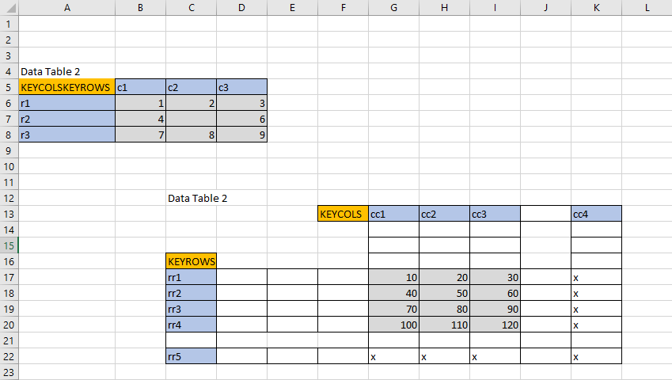

Example Solutions
=================

Reading Semi Structured data
----------------------------
- Question posted on `stackoverflow <https://stackoverflow.com/questions/59533824/python-extract-data-from-a-semi-structured-xlsx-file/59534919#59534919>`_

- Problem: read groups of 2D data from a single sheet that can begin at any row/col and has any
  number of rows/columns per data group, see figure below.

- Solution:

.. code-block:: python

    import pylightxl
    db = pylightxl.readxl('Book1.xlsx')
    # pull out all the rowIDs where data groups start
    keyrows = [rowID for rowID, row in enumerate(db.ws('Sheet1').rows,1) if 'val1' in row]

    # find the columnIDs where data groups start (like in your example, not all data groups start in col A)
    keycols = []
    for keyrow in keyrows:
        # add +1 since python index start from 0
        keycols.append(db.ws('Sheet1').row(keyrow).index('val1') + 1)

    # define a dict to hold your data groups
    datagroups = {}
    # populate datatables
    for tableIndex, keyrow in enumerate(keyrows,1):
        i = 0
        # data groups: keys are group IDs starting from 1, list: list of data rows (ie: val1, val2...)
        datagroups.update({tableIndex: []})
        while True:
            # pull out the current group row of data, and remove leading cells with keycols
            datarow = db.ws('Sheet1').row(keyrow + i)[keycols[tableIndex-1]:]
            # check if the current row is still part of the datagroup
            if datarow[0] == '':
                # current row is empty and is no longer part of the data group
                break
            datagroups[tableIndex].append(datarow)
            i += 1

    print(datagroups[1])
    >>> [[1, 2, 3, ''], [4, 5, 6, ''], [7, 8, 9, '']]
    print(datagroups[2])
    >>> [[9, 1, 4], [2, 4, 1], [3, 2, 1]]

